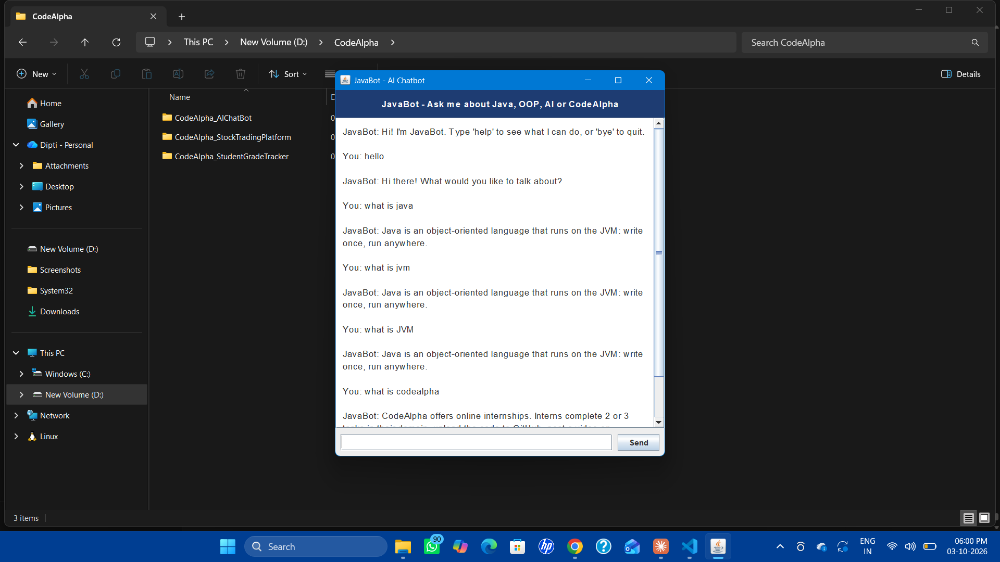

# CodeAlpha AI Chatbot (JavaBot)

A Java chatbot with a rule-based NLP engine and a Swing GUI. It answers frequently asked questions about Java, OOP, Python, AI, GitHub and the CodeAlpha internship.

## Features
- NLP pipeline: normalization, tokenization, stop-word removal and stemming
- Topic scoring: every topic is scored on matching words (1 point) and phrases (2 points), and the best score wins
- FAQ knowledge is stored as data (`Intent` objects), so new topics are easy to add
- Swing chat window (`AIChatbotGUI`) and a console version (`AIChatbot`)
- `nlp: your sentence` command shows how the bot reads a sentence: tokens, scores and the chosen topic


## How to run
Compile both files together:
```
javac AIChatbot.java AIChatbotGUI.java
```
Run the GUI:
```
java AIChatbotGUI
```
Or run the console version:
```
java AIChatbot
```

## Example questions
- `what is oop`
- `what is codealpha`
- `tell me a joke`
- `nlp: Explain object oriented programming in Java`

## Design
- `AIChatbot`: the NLP helpers, the topic list and the `reply()` method
- `AIChatbotGUI`: the window; it only calls `AIChatbot.reply()`, so the interface and the logic stay separate

## Built with
Java, Swing, collections (List, Set), string processing

Internship task for CodeAlpha.